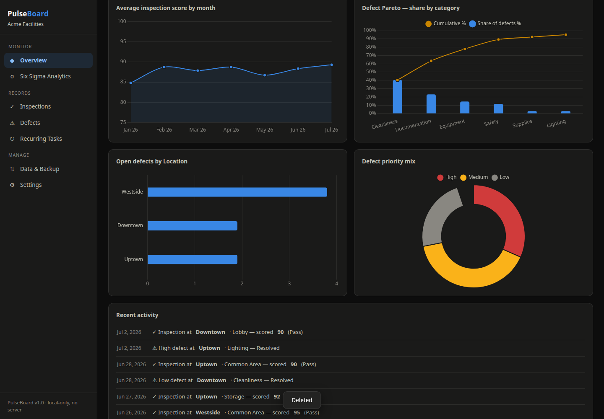
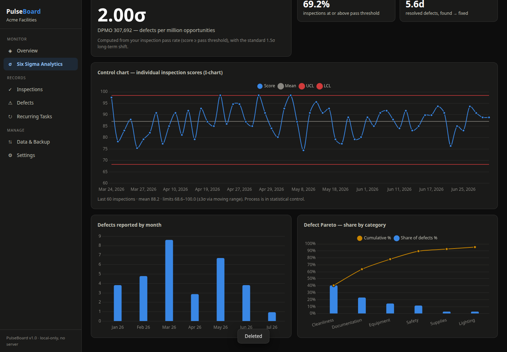

# PulseBoard

**A free, self-contained process quality dashboard.** Track inspections, defects, and recurring tasks for *anything* — sites, stores, schools, buildings, machines, teams, clients — and get Six Sigma analytics computed live from your own records.

No server. No account. No install. Your data never leaves your browser.



## Why

Most quality-tracking tools are either a spreadsheet you stop updating or enterprise software you can't afford. PulseBoard is one HTML file: open it, answer two setup questions, and you have a working dashboard with control charts, Pareto analysis, and a sigma level — driven entirely by the data you enter.

## Quick start

**Option 1 — just open it**
Download this repo (green **Code** button → *Download ZIP*), unzip, double-click `index.html`. That's it.

**Option 2 — GitHub Pages**
Fork this repo → Settings → Pages → deploy from the `main` branch. Your dashboard is now at `https://<you>.github.io/pulseboard/` on any device.

**Option 3 — local server**
```bash
git clone https://github.com/<you>/pulseboard && cd pulseboard
python3 -m http.server 8787
# open http://localhost:8787
```

First launch runs a 30-second setup wizard: name your organization, say what you track ("Stores"? "Machines"? — it relabels the whole app), optionally list them, and choose to start clean or explore with 6 months of sample data.

## Features

- **Track what *you* track.** The location label is fully customizable ("Site", "School", "Store", "Client"…) and renames every form, table, and chart. New values typed into any form are learned automatically and become suggestions.
- **Inspections** — score walk-throughs 0–100 with a slider; pass/marginal/fail thresholds are yours to set.
- **Defects** — report, prioritize, assign, filter, and resolve; resolution dates are stamped automatically.
- **Recurring tasks** — weekly/monthly/quarterly work rolls its due date forward when you mark it done; overdue items are flagged.
- **Six Sigma analytics, computed for real** — process sigma level and DPMO from your pass rate (with the standard 1.5σ shift), an individuals control chart with ±3σ limits estimated via moving range, Pareto analysis, and mean time to resolve.
- **Custom KPI tiles** — put any number you track elsewhere (cost/sq ft, uptime, NPS) on the overview with a target and a green/red check.
- **Data is yours** — one-click JSON backup/restore and CSV exports for Excel/Sheets. Everything lives in `localStorage`; clear it from *Data & Backup* any time.
- **Dark, colorblind-validated charts** — the palette passes CVD-separation and contrast checks; every chart has a legend and a table twin.



## Keeping the busywork low

PulseBoard is designed around a 3-touch routine:

1. **After each inspection (~1 min):** Inspections → *＋ Log inspection*. The form stays open for rapid entry.
2. **When you spot a problem (~30 s):** Defects → *＋ Report defect*.
3. **Weekly (~2 min):** mark tasks done (they reschedule themselves) and glance at the overview.

Everything else — sigma level, control limits, Pareto, trends — is computed for you.

## Data & privacy

All data is stored in your browser's `localStorage` under `pb_*` keys, scoped to wherever you open the file. Nothing is transmitted anywhere. Consequences worth knowing:

- Different browser (or device) = different data. Use **Data & Backup → JSON backup** to move or share data.
- Clearing the browser's site data erases your records. Back up anything you care about.
- One browser = one dataset. For multiple separate dashboards, host copies at different paths.

## Tech notes

- Single `index.html` (~65 KB) + vendored [Chart.js 4.4.4](https://www.chartjs.org/) (`chart.min.js`) so it works fully offline.
- No build step, no dependencies, no framework. Plain HTML/CSS/JS.
- Works in any modern browser, including from a `file://` double-click.

## Contributing

Issues and PRs welcome. The whole app is one file — read top to bottom: CSS → markup (one `<section>` per page) → JS (storage → stats → charts → per-page renderers → wiring).

## License

[MIT](LICENSE)
